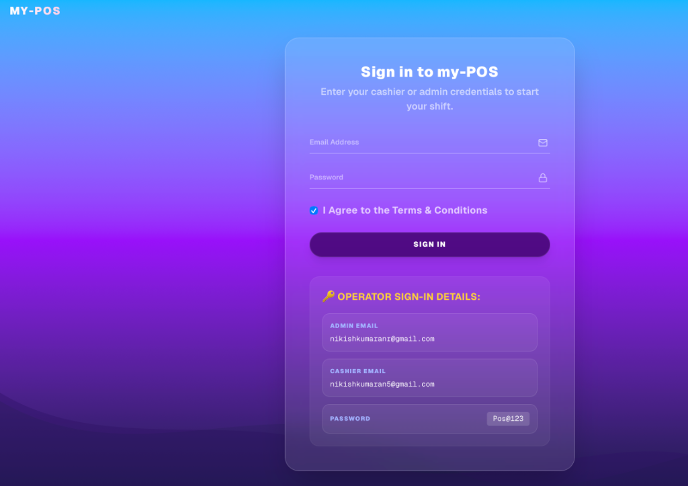
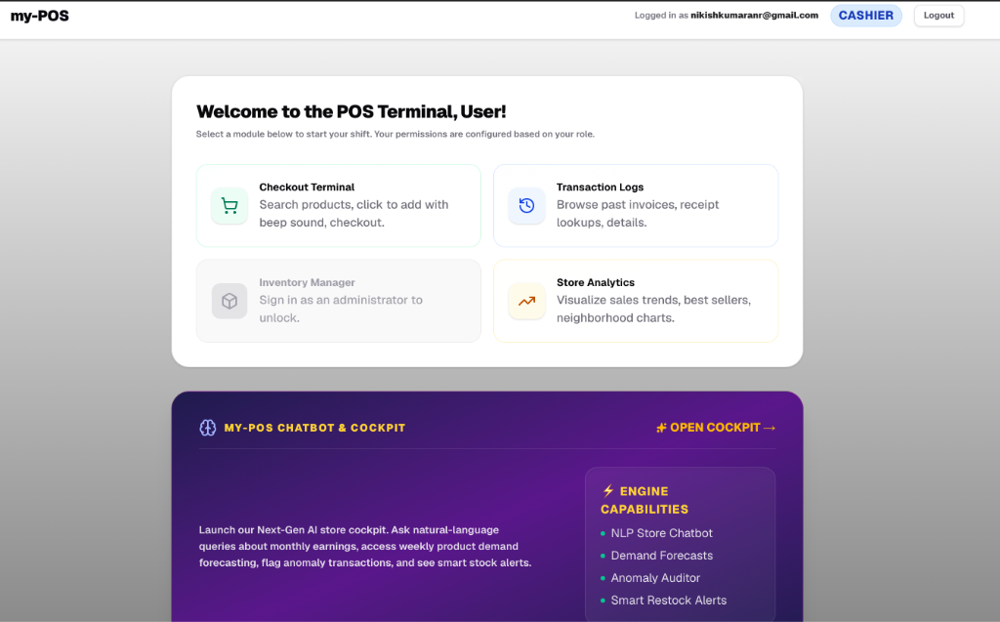
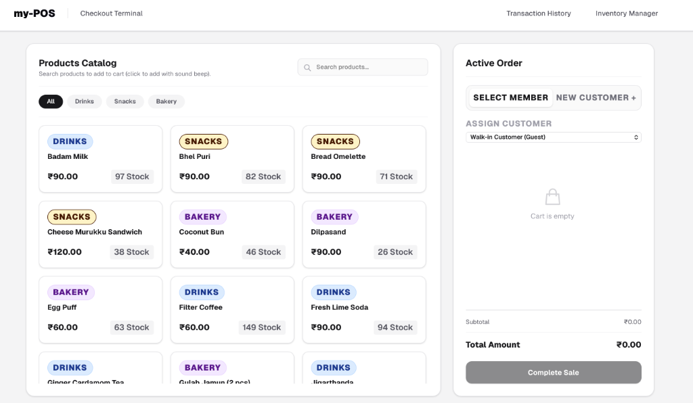
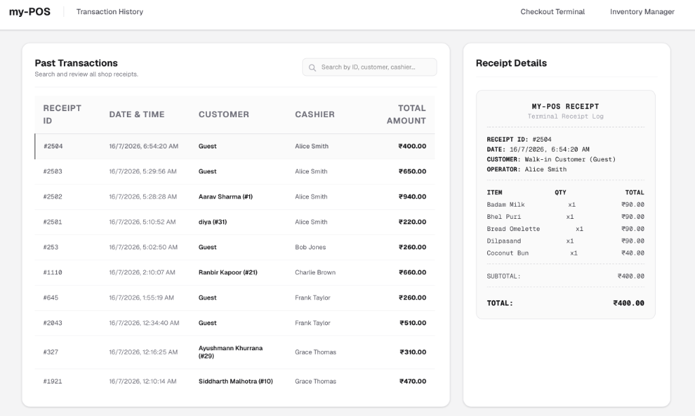
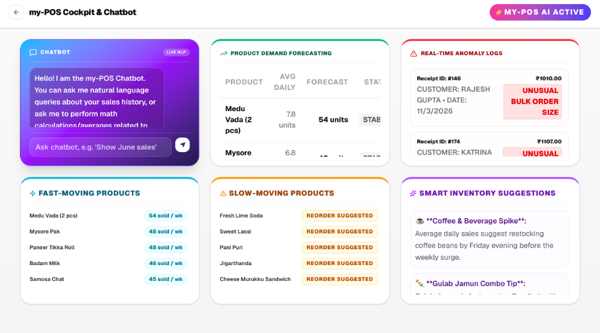

# my-POS — Next-Gen Smart POS & Retail Intelligence Cockpit

A premium, full-stack Next.js and Supabase-powered Point of Sale (POS) system designed for busy supermarkets. It integrates advanced business logic, real-time analytics, automated inventory intelligence, anomaly auditing, and a custom natural-language Chatbot.

🖥️ **Live App URL**: [https://my-pos-lyart.vercel.app/](https://my-pos-lyart.vercel.app/)  
🤖 **Intelligence Cockpit & Chatbot**: [https://my-pos-lyart.vercel.app/ai-manager](https://my-pos-lyart.vercel.app/ai-manager)

---

## 📸 Screenshots

<table>
  <tr>
    <td align="center"><b>🌅 Sunset Login Screen</b></td>
    <td align="center"><b>💻 Operator Dashboard</b></td>
  </tr>
  <tr>
    <td></td>
    <td></td>
  </tr>
  <tr>
    <td align="center"><b>🛒 Checkout & Billing Terminal</b></td>
    <td align="center"><b>📜 Transaction History Logs</b></td>
  </tr>
  <tr>
    <td></td>
    <td></td>
  </tr>
  <tr>
    <td align="center" colspan="2"><b>🤖 Cockpit Control & Live Chatbot</b></td>
  </tr>
  <tr>
    <td align="center" colspan="2"></td>
  </tr>
</table>

---

## 🔑 Operator Sign-In Credentials

Sign in directly on the [Login Screen](https://my-pos-lyart.vercel.app/login) using these pre-configured project credentials:

* **Admin Role**: `nikishkumaranr@gmail.com`
* **Cashier Role**: `nikishkumaran5@gmail.com`
* **Password**: `Pos@123`

*(Note: Roles are stored securely in the PostgreSQL public database. If you add new accounts in Supabase Auth, remember to insert them into the `users` table with their corresponding `role` value of `'admin'` or `'cashier'`)*

---

## ✨ Features & Architecture

### 1. 🛒 Dynamic Checkout & Sound Effects
* **Vibrant Interface**: Highly polished glassmorphic UI matching premium color guides.
* **Audio Interactivity**: Realistic scanner and cart sounds trigger on cart addition and checkout completion.
* **Smart Search**: Real-time product search list (removed scan placeholder mock for clean production usage).

### 2. 🎗️ Loyalty Reward System (Value Members)
* **Value Members Tab**: Separate toggle/modal to view and capture name, ID, and consent of loyalty participants.
* **5% Loyalty Cycle**: Applies a 5% discount on the total bill. Follows a strict cycle: member makes 3 full-price purchases, and their 4th purchase automatically receives the discounted price.
* **Invoice Transparency**: Discounts are calculated dynamically and printed directly on the receipt/invoice block.

### 3. 🤖 AI Chatbot (NLP Intelligence Engine)
* **Sunset Theme Colors**: Beautiful interface sharing the custom sky-pink-purple sunrise gradient of the login page.
* **Dynamic Database Queries**: Custom query parsing engine that dynamically extracts metrics, revenue statistics, customer types, and aggregates from your live Supabase database.
* **Calculations & Math**: Resolves arbitrary math expressions (e.g., `1500 * 0.10`) directly within the chat window.

### 4. 📈 Retail Analytics & Inventory Control
* **Demand Forecasting**: Runs automated 7-day projections scaled at a 15x supermarket density velocity to display realistic velocities during project presentations.
* **Real-time Anomaly Logs**: Scans transactions in real-time, automatically auditing and logging suspicious bulk order sizes or volume anomalies.
* **Inventory Alerts**: Identifies fast-moving vs slow-moving inventory and prints automated restock hints.

---

## 🛠️ Tech Stack

* **Frontend Framework**: Next.js 16 (App Router, TypeScript, React 19)
* **UI/Styles**: Tailwind CSS, Vanilla CSS, Lucide Icons, Glassmorphism
* **Database & Auth**: Supabase (PostgreSQL, Supabase Auth, Row-Level Security)
* **Charts**: Recharts (interactive high-contrast visualizer)
* **Deployment**: Vercel

---

## 🚀 How to Run Locally

### 1. Clone the Repository
```bash
git clone https://github.com/Nikish1429/my-pos.git
cd my-pos
```

### 2. Install Dependencies
```bash
npm install
```

### 3. Configure Environment Variables
Create a `.env.local` file in the root directory:
```env
NEXT_PUBLIC_SUPABASE_URL=your-supabase-url
NEXT_PUBLIC_SUPABASE_ANON_KEY=your-supabase-anon-key
```

### 4. Run the Development Server
```bash
npm run dev
```
Open [http://localhost:3000](http://localhost:3000) to view your local Point of Sale system.

---

## 💾 Database Setup (SQL Query)

To assign database roles to your login operators, execute this query in your **Supabase SQL Editor**:

```sql
-- 1. Create/Update Admin User Role
insert into public.users (name, email, role)
values ('Nikish Kumaran (Admin)', 'nikishkumaranr@gmail.com', 'admin')
on conflict (email) 
do update set role = 'admin', name = 'Nikish Kumaran (Admin)';

-- 2. Create/Update Cashier User Role
insert into public.users (name, email, role)
values ('Nikish Kumaran (Cashier)', 'nikishkumaran5@gmail.com', 'cashier')
on conflict (email) 
do update set role = 'cashier', name = 'Nikish Kumaran (Cashier)';
```
